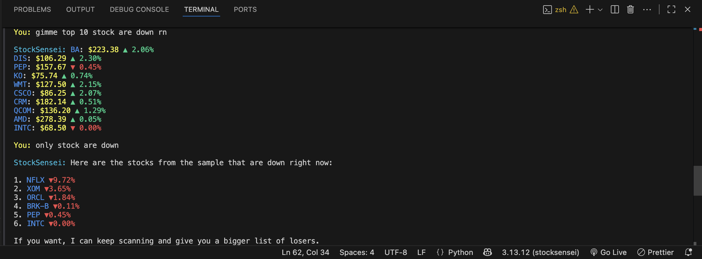
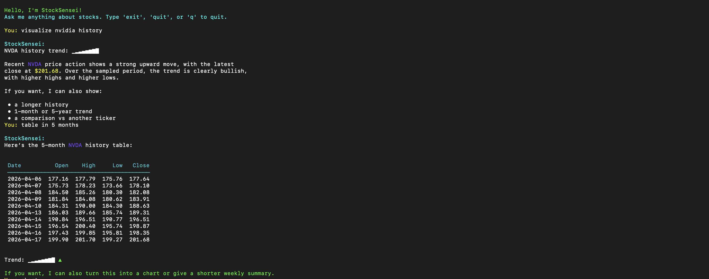
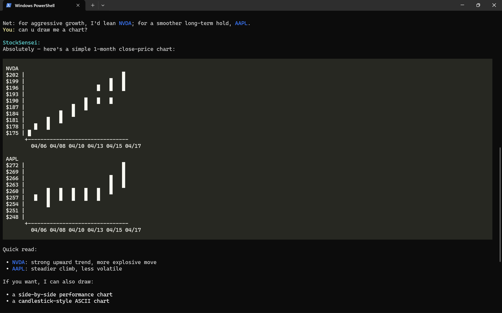

# StockSensei 📈

StockSensei is an intelligent, AI-powered **terminal CLI application** that acts as your personal expert financial analyst — running entirely inside your terminal. Built with Python, LangChain, and `yfinance`, it lets you query real-time stock data, compare companies, generate ASCII price charts, and read market news using plain natural language. No browser. No dashboard. Just your terminal.

---

## ✨ Features

- **🖥️ Runs Entirely in Your Terminal** — A first-class command-line experience built for developers and traders who live in the terminal. Launch it globally with one command from any directory.
- **💬 Natural Language Interaction** — Ask questions the way you think: *"Is NVDA a better buy than AAPL right now?"* or *"Show me Tesla's trend over the last 3 months."*
- **📊 ASCII Price Charts** — Visualize historical price trends right in your terminal with a generated scatter chart, sparkline trend indicator, and annotated date range.
- **📋 Beautiful Data Tables** — Side-by-side stock comparisons are rendered as clean, properly aligned tables using `rich` — no more ugly pipe characters.
- **📡 Real-Time Market Data** — Live prices, daily % changes, market caps, P/E ratios, 52-week highs/lows, and more via `yfinance`.
- **📰 News Integration** — Fetch the latest headlines for any stock or company.
- **🧠 Conversational Memory** — The agent remembers context within your session, so follow-up questions just work.
- **🤖 Multi-Provider AI Support** — Choose from OpenAI, Anthropic, Gemini, Groq, DeepSeek, OpenRouter, Ollama, or any custom OpenAI-compatible endpoint. Switch providers mid-session with `/models`.
- **🔐 Zero-Config Setup** — On first launch, StockSensei walks you through picking a provider and saving your API key globally — so you never have to set it again.

---

## 📸 Visual Examples

Here are a few examples of StockSensei's terminal UI in action:



 

---

## 🛠️ Tech Stack

| Layer | Technology | Purpose |
|---|---|---|
| Language | Python >= 3.13 | Core runtime |
| Financial Data | [yfinance](https://github.com/ranaroussi/yfinance) | Real-time prices, OHLC history, news, company info |
| AI Framework | [LangChain](https://github.com/langchain-ai/langchain) | LLM abstractions, prompt templates, tool-calling agent |
| LLM Providers | OpenAI, Anthropic, Gemini, Groq, DeepSeek, OpenRouter, Ollama | Swappable AI backends via `/models` |
| Agent State | [LangGraph](https://github.com/langchain-ai/langgraph) | Conversation memory and session checkpointing |
| Terminal UI | [Rich](https://github.com/Textualize/rich) | Beautiful markdown tables and formatted output |
| Environment | `python-dotenv` | Secure `.env` loading for local development |
| Package Manager | `uv` | Fast dependency resolution and global CLI installation |

---

## ⚙️ Prerequisites

StockSensei uses [`uv`](https://docs.astral.sh/uv/) for installation. If you don't have it yet, install it first:

**Mac/Linux:**
```bash
curl -LsSf https://astral.sh/uv/install.sh | sh
```

**Windows (PowerShell):**
```powershell
powershell -ExecutionPolicy ByPass -c "irm https://astral.sh/uv/install.ps1 | iex"
```

Once installed, restart your terminal to make sure `uv` is available.

---

## 🚀 Installation & Setup

**The Easiest Way (Global Install)**  
Install StockSensei in a single command directly from GitHub. No cloning required:

```bash
uv tool install git+https://github.com/lenminh002/StockSensei.git
```

Then just run it from anywhere:
```bash
stocksensei
```

On first launch, StockSensei will walk you through selecting an AI provider and entering your API key — saved permanently so you only ever do this once.

---

**Updating to the Latest Version**  
To update StockSensei to the newest version:

```bash
uv tool upgrade stocksensei
```

*(If that doesn't pick up the latest changes, force a reinstall: `uv tool install --force git+https://github.com/lenminh002/StockSensei.git`)*

---

**Developer Setup (Local Cloning)**  
To modify the code or contribute:
```bash
git clone https://github.com/lenminh002/StockSensei.git
cd StockSensei
uv sync
uv run main.py
```

---

## 💡 Usage

Once running, just type your questions in plain English:

```
You: nvidia vs apple
StockSensei: [Renders a comparison table with price, P/E, market cap, 52w range]

You: show me nvda's chart for the last 3 months
StockSensei: [Draws an ASCII price chart with date range and trend indicator]

You: what's the latest news on tesla?
StockSensei: [Lists the 10 most recent headlines]
```

Type `exit`, `quit`, or `q` to close the app.

### Switching Providers & Models

Type `/models` at any time during a session to switch your AI provider or model:

```
You: /models

Current: openai / gpt-4.1-mini
Select provider:
  1. openai  (default: gpt-4.1-mini)
  2. anthropic  (default: claude-sonnet-4-6)
  3. groq  (default: llama-3.3-70b-versatile)
  4. + Add new provider
Your choice: 2

Select model:
  1. claude-opus-4-7
  2. claude-sonnet-4-6
  3. claude-haiku-4-5-20251001
Your choice: 1

✓ Switched to anthropic / claude-opus-4-7
```

Your selection is saved to `~/.stocksensei_config.json` and remembered across sessions.

---

## 🤖 Supported Providers

| Provider | Models |
|---|---|
| **OpenAI** | gpt-5.4, gpt-5.4-mini, o3, o4-mini, gpt-4o, gpt-4o-mini |
| **Anthropic** | claude-opus-4-7, claude-opus-4-6, claude-sonnet-4-6, claude-haiku-4-5-20251001 |
| **Gemini** | gemini-3.1-pro-preview, gemini-3-flash-preview, gemini-3.1-flash-lite-preview, gemini-3-deep-think, gemini-2.5-pro, gemini-2.5-flash |
| **Groq** | llama-3.3-70b-versatile, llama-3.1-8b-instant, mixtral-8x7b-32768 |
| **DeepSeek** | deepseek-chat, deepseek-reasoner |
| **OpenRouter** | openai/gpt-4.1-mini, anthropic/claude-opus-4-7, google/gemini-2.5-pro, meta-llama/llama-3.3-70b-instruct |
| **Ollama** | llama3.2, qwen2.5, mistral |
| **Custom** | Any OpenAI-compatible endpoint |

---

## 📝 Notes

- **Config file:** Provider settings and API keys are stored in `~/.stocksensei_config.json`.
- **Cross-Platform:** Works on macOS, Linux, and Windows (PowerShell).

---

## 🗑️ Uninstall

**1. Uninstall the CLI tool:**
```bash
uv tool uninstall stocksensei
```

**2. Remove saved config** *(optional — only if you want a full clean removal):*

Mac/Linux:
```bash
rm ~/.stocksensei_config.json
```

Windows (PowerShell):
```powershell
Remove-Item "$HOME\.stocksensei_config.json"
```
